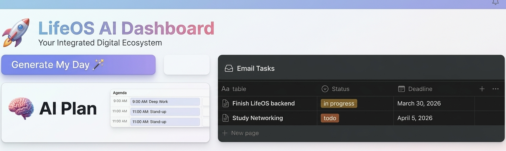

# 🚀 LifeOS AI – Notion-Powered AI Agent



## 🧠 Overview
LifeOS AI is an intelligent productivity system that transforms Notion into a central operating system for your digital life.

It integrates Gmail, AI, and Notion to automatically convert emails into actionable tasks and generate smart daily plans.

---

## 💡 Problem
Modern workflows are scattered across:
- Emails 📩
- Tasks 📋
- Notes 📝

Most AI tools lack real context and cannot act across multiple platforms.

---

## 🚀 Solution
LifeOS AI solves this by:
- Reading emails from Gmail
- Extracting actionable tasks
- Automatically creating tasks in Notion
- Generating intelligent daily plans

👉 Workflow:

---

## ⚙️ Features

- 📩 Email → Task Automation  
- 🤖 AI Task Planning  
- 📊 Notion Integration  
- 🚀 One-click workflow execution  
- 🧠 Smart daily planning  

---
## 📊 System Architecture
  📩 Gmail API
         ↓
  (Fetch Emails)
         ↓
    🤖 AI Engine

(Task Extraction & Planning)
         ↓
⚙️ Backend (Node.js)
         ↓
📊 Notion Database
(Task Creation & Storage)
         ↓
🎨 Frontend (React)
(User Dashboard & Controls)

## 🛠 Tech Stack

### Frontend:
- React.js  
- HTML / CSS  

### Backend:
- Node.js  
- Express.js  

### APIs & Integrations:
- Notion API  
- Gmail API  
- OpenAI API  

### Tools:
- Axios  
- dotenv  
- CORS  

---


---

## 🔐 Environment Variables

Create a `.env` file:
NOTION_API_KEY=your_key
NOTION_DATABASE_ID=your_database_id
OPENAI_API_KEY=your_key


⚠️ Do not share this file publicly

---

## ▶️ Run Locally

```bash
npm install
node server.js
## Frontend:

cd lifeos-ui
npm install
npm start
